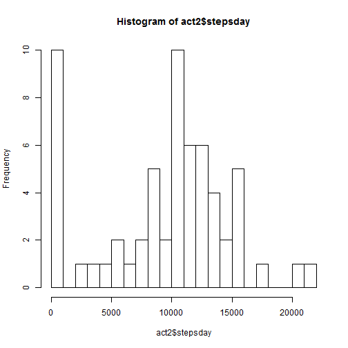
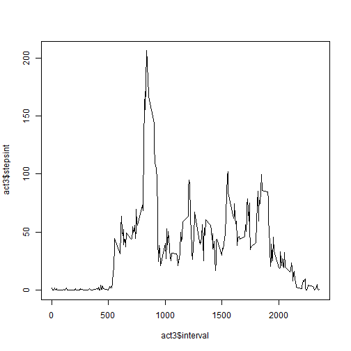
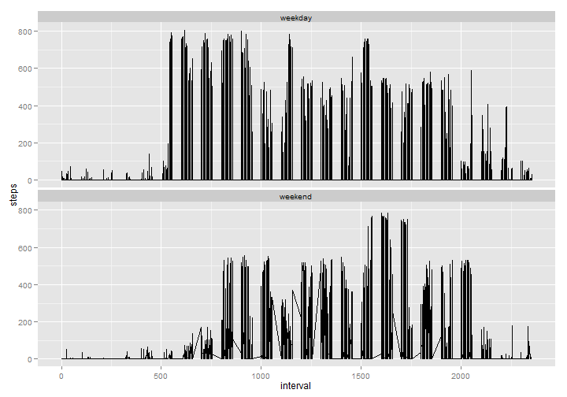

## Loading and preprocessing the data


```r
#opts_chunk$set(echo=TRUE,)
```


```r
if (!file.exists("./activity.csv")) {
        download.file("https://d396qusza40orc.cloudfront.net/repdata%2Fdata%2Factivity.zip", "./repdata_data_activity.zip")
        unzip("./repdata_data_activity.zip", overwrite = T, exdir = ".")
}

act <- read.csv(file = "activity.csv", sep=",", na.strings = "NA")

library(stringr)
act$inttemp <- str_pad(act$interval, width=4, side = "left", "0")
act$inttemp <- str_c(str_sub(act$inttemp, start = 1,end = 2), ":",
      str_sub(act$inttemp, start = 3,end = 4), sep = "")
act$inttemp <- str_c(act$date, act$inttemp, sep = " ")
act$inttemp <- as.Date(strptime(act$inttemp, format ="%Y-%m-%d %H:%M"))
act$date2 <- as.Date(act$inttemp, "%Y-%m-%d")
```

## What is mean total number of steps taken per day?


```r
library(dplyr)
```

```
## 
## Attaching package: 'dplyr'
## 
## The following object is masked from 'package:stats':
## 
##     filter
## 
## The following objects are masked from 'package:base':
## 
##     intersect, setdiff, setequal, union
```

```r
act2 <- act %>% group_by(date) %>% summarise(stepsday=sum(steps, na.rm = TRUE))
hist(act2$stepsday,breaks = 20)
```

 

```r
mean(act2$stepsday, na.rm = TRUE)
```

```
## [1] 9354.23
```

```r
median(act2$stepsday, na.rm = TRUE)
```

```
## [1] 10395
```

the mean is 9 354 and the median is 10 395.


## What is the average daily activity pattern?


```r
act3 <- act %>% group_by(interval) %>% summarise(stepsint=mean(steps, na.rm = TRUE))
plot(act3$interval, act3$stepsint, type= "l")
```

 

The interval with the maximum steps on averge is 835

## Imputing missing values

the count of missing values is:


```r
sapply(act, function(x) sum(is.na(x)))
```

```
##    steps     date interval  inttemp    date2 
##     2304        0        0        0        0
```

```r
actNA <- left_join(act, act2)
```

```
## Joining by: "date"
```

```r
actNA$steps[is.na(actNA$steps)] <- actNA$stepsday[is.na(actNA$steps)]/(24*60/5)

act2 <- actNA %>% group_by(date) %>% summarise(stepsday=sum(steps, na.rm = TRUE))
hist(act2$stepsday,breaks = 20)
```

 

```r
mean(act2$stepsday, na.rm = TRUE)
```

```
## [1] 9354.23
```

```r
median(act2$stepsday, na.rm = TRUE)
```

```
## [1] 10395
```
once the missing value treated, the mean is 9354.2295082 and the median is 1.0395 &times; 10<sup>4</sup>.


## Are there differences in activity patterns between weekdays and weekends?


```r
actNA$we <- ifelse(tolower(weekdays(actNA$inttemp,abbreviate=TRUE)) %in% c("dim.", "sam.", "sun.", "sat."), "weekend", "weekday")
actNA$we <- as.factor(actNA$we)

library(ggplot2)
ggplot(actNA, aes(interval, steps)) + geom_line() + facet_wrap(~we,nrow = 2)
```

 
Visible slower start during the weekends, and more activity in the evening.
